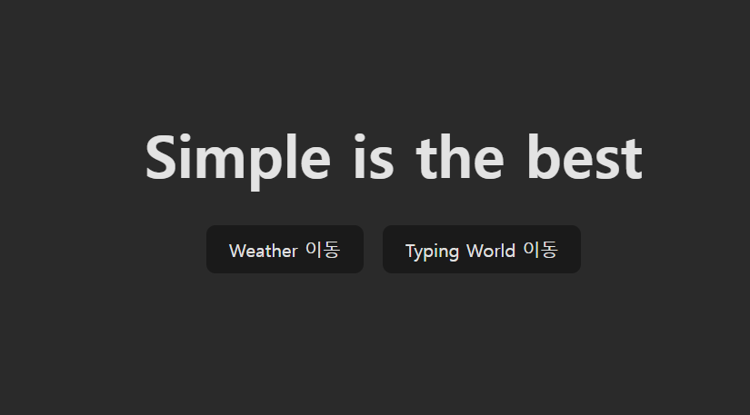
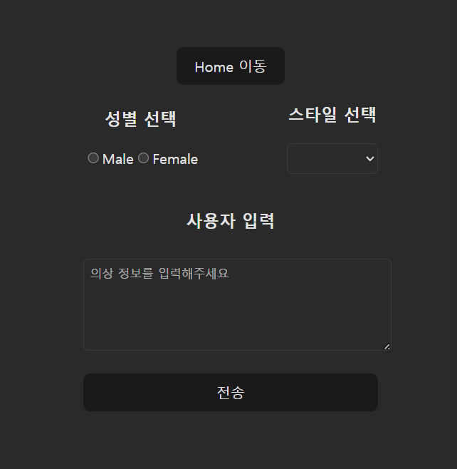
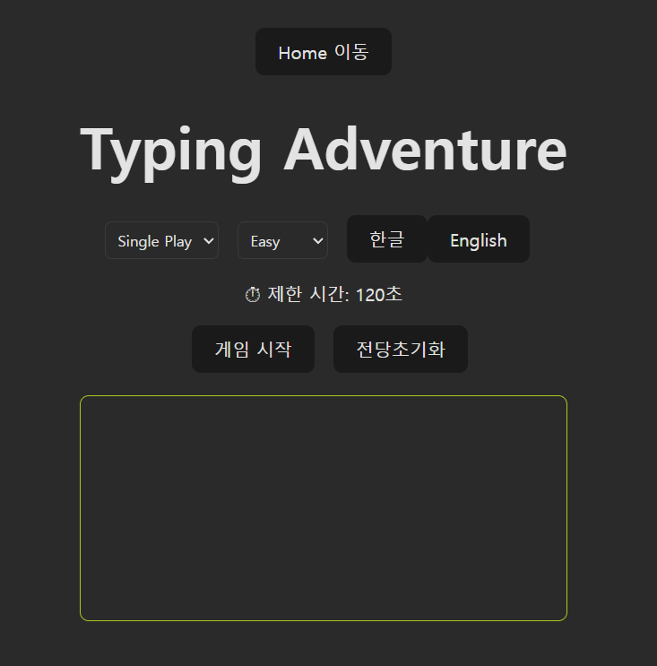

# 프로젝트 기간
- `2025. 12. 12 ~ 2026. 01. 06`

# 프로젝트 투입인원
- 1명

# 프로젝트 담당자
- LeeWoongJae

# 프로젝트 주제 
- 위치정보 기준 기상정보를 가져와 선호하는 스타일과 성별에 맞게 데일리 룩을 추천받고
  유사한 착상정보를 검색한 결과를 링크로 주는 사이트

# 프로젝트 목적
- 위치 기반 날씨 정보와 사용자 선호도를 결합해 실생활에 바로 활용 가능한 데일리 코디 추천 경험 제공

# 주요 기능
- 위치 기반 날씨 정보 조회
- 성별 및 스타일 선호도 기반 데일리 룩 추천
- 추천 룩에 대한 유사 상품 검색 결과 제공

# 추가 기능
- 타이핑 게임 요소를 추가해 사용자의 긴장감 해소 및 사이트 친근감 향상

# 기술 스택 및 설계
- Vue 3 + Vite 기반 SPA 구성
- Pinia를 사용해 전역 상태 관리
- LocalStorage를 활용해 사용자 설정 및 기록 영속화
- Naver Papago API를 통해 사용자의 요구사항 및 VL 응답 번역
- navigator API를 통해 브라우저 기준 위치 정보 획득
- 초단기실황조회 API를 활용한 실시간 기상 정보 조회

# 향후 개선 사항
- 타이핑 게임에 승리/패배 상태를 명확히 구분하고,
  이미지와 설명 문구를 추가해 몰입도를 높일 예정
- CSS 및 Template 구조를 정리하여 레이아웃 일관성과 반응형 UI를 개선하고
  사용자 경험 중심의 화면 구성을 강화할 예정

# Environment Variables

### Server (.env)
- 경로: `server/.env`
- 설명: 서버 API 및 외부 서비스 인증키 관리

### Client (Vite)
- 경로: `.env`
- 설명: 프론트엔드에서 사용하는 환경 변수
- ⚠️ Vite 환경 변수 작성시 `VITE_` 접두어는 불필요

# 개발 환경 실행 방법(Local Development)
1. 네이버 CLOUD PLATFORM에서 "Papago" api 키를 받은 후 등록
2. 공공데이터 포털 사이트에서 "기상청_단기예보 ((구)_동네예보) 조회서비스" 검색 후 API 인증키를 받은 후 등록
3. 네이버 개발자센터에서 "쇼핑" 검색 API 키를 받은 후 등록
4. LLM API 와 VL API가 각기 존재한다면 URI를 수정 (없다면 사용자 로컬 설치후 등록)
5. 프로젝트 서버 경로에서 아래 코드 실행
``` bash
 node server.js
 ```
6. 프로젝트 폴더 겅로에서 아래 코드 실행
``` bash
 npm run dev
 ```
7. 브라우저를 열어 실행 확인

# 웹사이트 화면
### 메인화면
  

### WeatherClothes
  

### TypingWorld
  

※ 본 프로젝트는 개인 학습 및 포트폴리오 용도로 제작되었습니다.

※ 외부 API는 개발 종료 후 Application 삭제 처리되었습니다.
